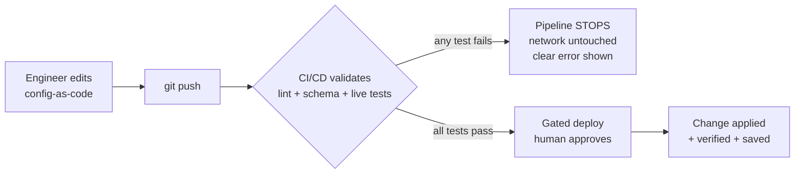
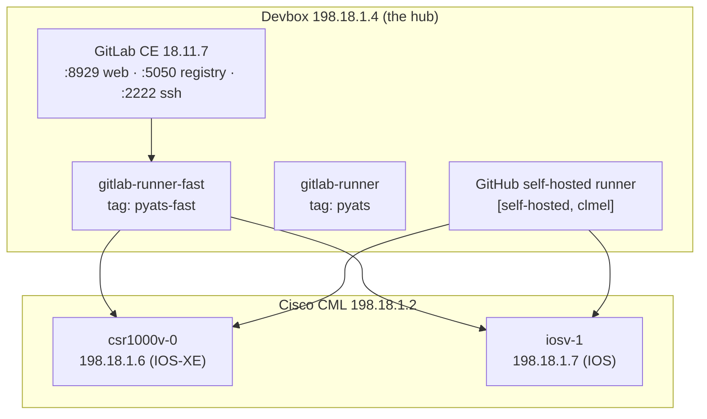
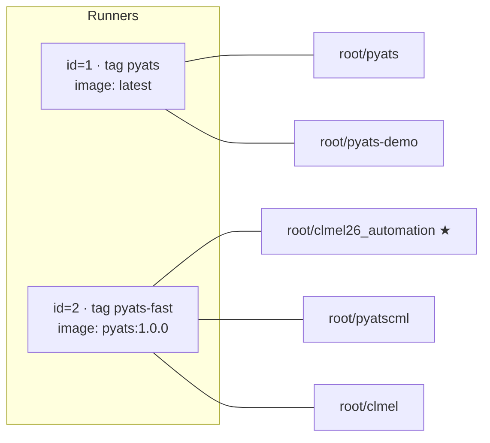

## 1. What this lab is

This repository is a **working example of "network as code."** Instead of an engineer logging into routers by hand and typing commands, the *intended* state of the network is written into small text files, committed to Git, and pushed. A **CI/CD pipeline** then automatically:

1. **Validates** the change (lint + schema checks + live network tests), and
2. Only if validation passes, **deploys** the change to the routers.

The lab deliberately demonstrates **two independent automation stacks** against the **same** pair of virtual routers, so you can compare approaches:

| Stack | Tooling | What it manages | Where it runs |
| --- | --- | --- | --- |
| **Ansible VLAN task** | Ansible + `cisco.ios` collection | VLANs and access‑port assignments | GitLab CI **and** a mirrored GitHub Actions pipeline |
| **pyATS/Genie tasks** | Cisco pyATS + Genie + Unicon | Reachability tests, static‑route checks, Loopback interfaces | GitLab CI |

And it demonstrates **two CI/CD platforms**:

- **GitLab CI/CD** — the lab's *real* CI system, running on the devbox at `198.18.1.4`. This is where the `.gitlab-ci.yml` pipeline executes.
- **GitHub Actions** — a mirror of the Ansible pipeline that runs on a **self‑hosted** GitHub runner registered on the same devbox.

> **The one idea to take away:** *Validate before you touch production. If any test fails, change nothing.* Every job in this project is built around that guardrail.

---

## 2. Why CI/CD? Importance & benefits to the company

### The problem CI/CD solves

Traditional network changes are **manual, unaudited, and risky**:

- A single mistyped VLAN id or interface name can black‑hole traffic.
- Changes are applied straight to production with no automated test.
- There is no consistent record of *who* changed *what*, *why*, or whether it was reviewed.
- Knowledge lives in individuals' heads, not in the system.

### What this pipeline gives you

### Benefits to the company

| Benefit | How this lab delivers it |
| --- | --- |
| **Risk reduction** | A wrong VLAN id (e.g. `5000`) or an unreachable network is caught *before* any device is touched — the deploy never runs. |
| **Test before touch** | pyATS pings the network and Ansible asserts the schema *first*; production is only changed after a green result. |
| **Repeatability & consistency** | The same playbook/script produces the same result every time — no "it works on my laptop" drift. |
| **Peer review & audit** | Every change is a Git commit: reviewable, revertable, and traceable to an author and a pipeline run. |
| **Safe, gated production** | The production stage is **manual / approval‑gated** — a human clicks *Deploy* only after tests are green. |
| **Faster, cheaper changes** | Automation removes slow, error‑prone manual steps and the rework caused by outages. |
| **Knowledge capture** | The "how" lives in the repo (playbooks, tests, docs), not in one engineer's memory. |
| **Idempotency** | Re‑running a job does not create duplicates (e.g. an existing Loopback is skipped), so pipelines are safe to retry. |

---

## 3. Lab environment & topology

Everything runs inside the CML‑hosted lab. The **devbox (`198.18.1.4`) is the hub**: it hosts GitLab, the CI runners, and is the only host that can reach the CML‑simulated routers.

| Component | Address | Credentials | Role |
| --- | --- | --- | --- |
| Cisco CML | `198.18.1.2` | `admin / C1sco12345` | Runs the virtual routers |
| GitLab Web UI | `http://198.18.1.4:8929/` | `root / C1sco12345` | Source control + CI/CD |
| GitLab container registry | `198.18.1.4:5050` | — | Hosts the pyATS runner image |
| GitLab SSH (git) | `198.18.1.4:2222` | — | Git over SSH |
| Devbox (Ubuntu) | `198.18.1.4` | `cisco / C1sco12345` | Hosts GitLab + runners; reaches routers |
| `iosv-1` (Cisco IOS) | `198.18.1.7` | `admin / C1sco12345`, enable `C1sco12345` | Router under test |
| `csr1000v-0` (Cisco IOS‑XE) | `198.18.1.6` | `admin / C1sco12345`, enable `C1sco12345` | Router under test |

---

## 4. CI/CD platforms & runners — what is configured and bound where

### GitLab runners (the real lab CI)

Two runner **containers** run on the devbox; each registers one runner with GitLab. Both use the **docker executor**. Runners are **project‑scoped** (not shared), so each project is explicitly bound to a runner.

| Runner container | GitLab runner | Tag | Executor | Default image | Bound to projects |
| --- | --- | --- | --- | --- | --- |
| `gitlab-runner` (ubuntu‑v18.11.4) | id=1 · "pyATS Docker runner" | `pyats` | docker | `latest` | `root/pyats`, `root/pyats-demo` |
| `gitlab-runner-fast` (alpine‑v18.11.4) | id=2 · "pyATS‑fast‑docker‑runner" | `pyats-fast` | docker | `198.18.1.4:5050/root/pyatscml/pyats:1.0.0` | **`root/clmel26_automation`**, `root/pyatscml`, `root/clmel` |

> **This project (`root/clmel26_automation`, project id 5, private) is bound to runner id=2, tag `pyats-fast`.** That is why `.gitlab-ci.yml` sets `tags: ["pyats-fast"]` and the pyATS image as the default — the runner already has pyATS/Genie/Unicon, and Ansible is pip‑installed at job start.

**All GitLab projects on this server:**

| id | Project | Visibility | Runner |
| --- | --- | --- | --- |
| 1 | `root/pyats` | public | `pyats` |
| 2 | `root/pyats-demo` | public | `pyats` |
| 3 | `root/pyatscml` | private | `pyats-fast` |
| 4 | `root/clmel` | public | `pyats-fast` |
| 5 | **`root/clmel26_automation`** | private | **`pyats-fast`** |

### GitHub Actions runner (the mirror)

The Ansible pipeline also runs on GitHub via `.github/workflows/ansible-vlan.yml`, targeting a **self‑hosted** runner labelled `[self-hosted, clmel]` registered on the *same* devbox — because only the devbox can reach the CML routers. GitHub‑hosted (cloud) runners cannot reach `198.18.1.6/.7`, so a self‑hosted runner is required for anything that touches the devices.
