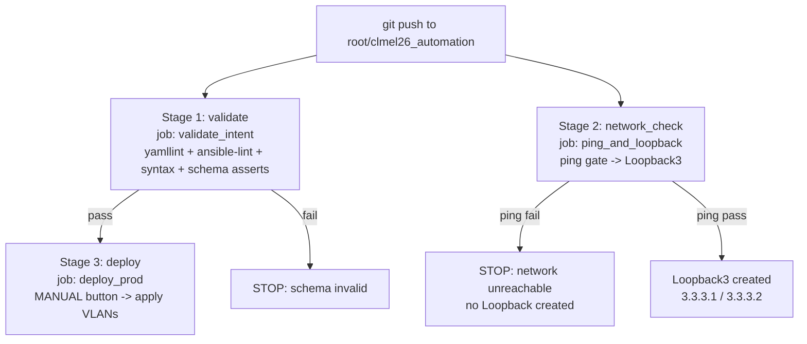

## 8. Pipeline stages & flow

### GitLab CI/CD (`.gitlab-ci.yml`)



- **`validate` → `validate_intent`**: installs Ansible + linters, then runs `yamllint`, `ansible-lint`, `--syntax-check`, and `validate_vlans.yml`. Pure static checks — **no device is touched**.
- **`network_check` → `ping_and_loopback`**: `needs: []` (independent), runs the pyATS ping‑gate script.
- **`deploy` → `deploy_prod`**: `needs: ["validate_intent"]` and `when: manual` — a human clicks **Deploy** in the GitLab UI; it dry‑runs then applies the VLANs to the routers.

### GitHub Actions (`.github/workflows/ansible-vlan.yml`)

`validate` (test/dev) → `deploy` (prod). `deploy` requires `needs: validate`, only runs on `main` (not on PRs), and uses `environment: production` (add required reviewers for an approval gate). Both jobs run on `[self-hosted, clmel]` on the devbox.

---

## 9. Failure scenarios — and how to check them

Each scenario below shows **how to trigger it**, **what you should see**, and **where to look**. These are the guardrails in action — in every case, **production is left untouched**.

### F1 — Invalid VLAN id (out of range)

- **Trigger:** in `ansible/vars/vlans.yml`, set a VLAN `id: 5000` (valid range is 1–4094), commit and push.
- **Expected:** the `validate` job fails on the "VLAN id must be a whole number 1‑4094" assertion with:
  > `INVALID VLAN id '5000' (name 'VOICE'). VLAN ids must be a whole number 1-4094 and must not use the reserved range 1002-1005. Fix vars/vlans.yml and push again.`
- **Where to check:** GitLab → **CI/CD → Pipelines → the failing `validate_intent` job log**; the `deploy` stage never starts.

### F2 — Invalid VLAN name or interface name

- **Trigger:** set a VLAN `name` containing a space (e.g. `VOICE PHONES`) *or* an interface like `GigabitEth0/1` (typo).
- **Expected:** the name assertion (`1-32 chars, letters/numbers/underscore/hyphen only`) or the interface assertion (`GigabitEthernet<slot>/<port>`) fails with a detailed message naming the offending value.
- **Where to check:** same `validate` job log.

### F3 — Duplicate VLAN id

- **Trigger:** define the same `id` twice in `vars/vlans.yml`.
- **Expected:** the "VLAN ids must be unique" assertion fails: `Duplicate VLAN ids detected …`.
- **Where to check:** `validate` job log.

### F4 — Network unreachable (ping gate)

- **Trigger:** in `configs/loopback3.yaml`, set `ping_target: 198.168.1.1` (an address the routers cannot reach), push.
- **Expected:** `ping_and_loopback` prints per‑router failures and stops **before** any config:
  ```
  ======================================================================
  STEP 1  Ping pre-check  ->  every router must reach 198.168.1.1
  ======================================================================
    [FAIL] iosv-1 -> 198.168.1.1: success rate 0%   (Success rate is 0 percent (0/5))
    [FAIL] csr1000v-0 -> 198.168.1.1: success rate 0%   (Success rate is 0 percent (0/5))
  ======================================================================
  PIPELINE FAILED  -  ping pre-check did not pass
  ======================================================================
  One or more routers cannot reach 198.168.1.1, so Loopback3 was
  NOT created on ANY device. Fix reachability and re-run the pipeline.
  ```
  The job exits `1` → the `network_check` stage is red → **no Loopback3 is created on either router.**
- **Where to check:** the `ping_and_loopback` job log. Confirm on the routers that `Loopback3` is absent: `show ip interface brief | include Loopback3`.

> This scenario was verified live against the lab routers: target `198.168.1.1` returns **0%** from both routers (fails), while `192.168.1.1` returns **100%** (passes).

---

## 10. Working scenarios — and how to check them

### W1 — Valid VLANs deploy

- **State:** `vars/vlans.yml` holds valid VLANs (the default: `USERS/10`, `VOICE/20`, `MGMT/30`).
- **Flow:** `validate` passes → click **Deploy** on `deploy_prod` → VLANs applied.
- **Verify on a router:**
  ```
  show vlan brief
  show running-config interface GigabitEthernet0/1   ! expect: switchport access vlan 10
  ```

### W2 — Ping passes → Loopback3 created

- **State:** `configs/loopback3.yaml` has `ping_target: 192.168.1.1` (reachable).
- **Expected job output:**
  ```
  STEP 1  Ping pre-check  ->  every router must reach 192.168.1.1
    [PASS] iosv-1 -> 192.168.1.1: success rate 100%   (... 5/5 ...)
    [PASS] csr1000v-0 -> 192.168.1.1: success rate 100%   (... 5/5 ...)
    OK: every router reached 192.168.1.1. Proceeding to Loopback3.
  STEP 2  Create Loopback3 on each router (skip if duplicate)
    [CFG ] csr1000v-0: creating Loopback3 3.3.3.1 255.255.255.255
    [OK  ] csr1000v-0: verified Loopback3 has 3.3.3.1
    [CFG ] iosv-1: creating Loopback3 3.3.3.2 255.255.255.255
    [OK  ] iosv-1: verified Loopback3 has 3.3.3.2
  SUCCESS  -  ping passed and Loopback3 is in place on all routers
  ```
- **Verify on the routers:**
  ```
  csr1000v-0#  show ip interface brief | include Loopback3     ! Loopback3  3.3.3.1  up  up
  iosv-1#      show ip interface brief | include Loopback3     ! Loopback3  3.3.3.2  up  up
  ```

### W3 — Duplicate Loopback is skipped (idempotent)

- **State:** re‑run W2 when `Loopback3` already exists (or its IP is used elsewhere).
- **Expected:** `[SKIP] … Loopback3 already exists (duplicate) - not re-creating` (or `duplicate IP`). The job still succeeds. Safe to retry pipelines.

### W4 — pyATS ping/route test passes

- Run `pyats run job jobs/smoke_job.py --testbed-file testbed/testbed.yaml`. `PingGateway` passes when both routers reach `192.168.1.1` at 100%; `StaticRoutesEqual` passes when both routers share the same static routes.
