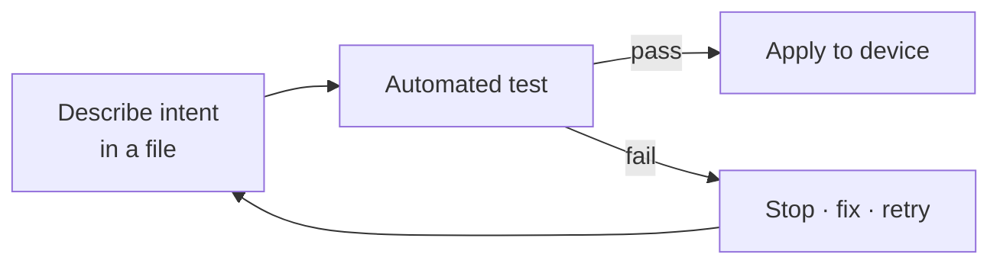
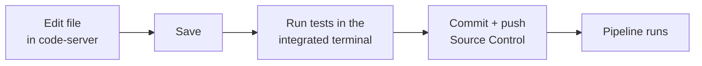
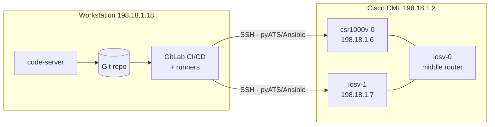
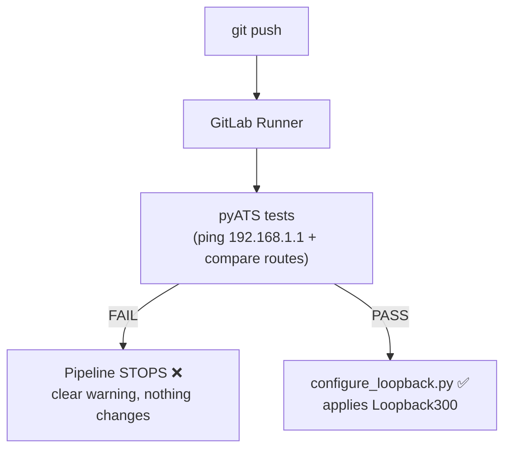
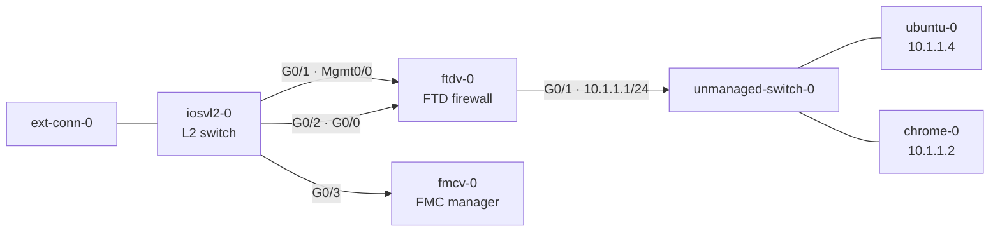
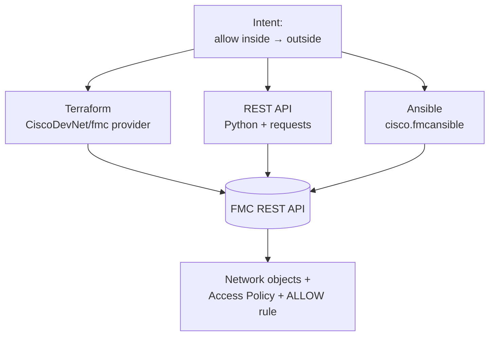
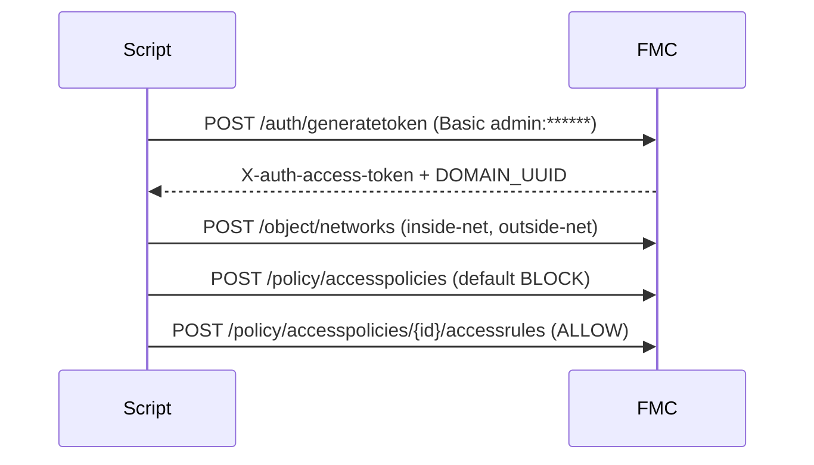

# dCloud Automation — Training Lab Guide

> **Audience:** Network & security engineers attending the automation labs.
> **What you'll learn:** How to build, test, and deploy network **and** firewall
> configuration *as code*, with automated guardrails so a change only reaches a
> device when every test passes.
>
> This guide covers **two labs**:
>
> | # | Lab | Tech | Folder |
> |---|-----|------|--------|
> | 1 | **NetDevOps CI/CD** — routers as code | pyATS · Ansible · GitLab CI/CD | `clmel26_automation/` |
> | 2 | **Cisco Security IaC** — FMC/FTD firewall as code | Terraform · REST API · Ansible | `cisco_security_iac/` |

---

## Table of contents

1. [Before you begin](#before-you-begin)
2. [Lab environment & access](#lab-environment--access)
3. [The codebase server IDE (code-server)](#the-codebase-server-ide-code-server)
4. [Lab 1 — NetDevOps CI/CD](#lab-1--netdevops-cicd)
   - [1.1 Goals & concepts](#11-goals--concepts)
   - [1.2 Topology](#12-topology)
   - [1.3 How the pipeline works](#13-how-the-pipeline-works)
   - [1.4 Repository tour — every file explained](#14-repository-tour--every-file-explained)
   - [1.5 Step-by-step setup](#15-step-by-step-setup)
   - [1.6 Test scenarios — what & why](#16-test-scenarios--what--why)
   - [1.7 The troubleshooting exercise](#17-the-troubleshooting-exercise)
   - [1.8 Verification checklist](#18-verification-checklist)
5. [Lab 2 — Cisco Security IaC (FMC/FTD)](#lab-2--cisco-security-iac-fmcftd)
   - [2.1 Goals & concepts](#21-goals--concepts)
   - [2.2 Topology & addressing](#22-topology--addressing)
   - [2.3 Three ways to do the same thing](#23-three-ways-to-do-the-same-thing)
   - [2.4 Terraform scenario](#24-terraform-scenario)
   - [2.5 REST API scenario](#25-rest-api-scenario)
   - [2.6 Ansible scenario](#26-ansible-scenario)
   - [2.7 Test cases — what & why](#27-test-cases--what--why)
   - [2.8 Verification checklist](#28-verification-checklist)
6. [Appendix A — Credentials](#appendix-a--credentials)
7. [Appendix B — Command cheat-sheet](#appendix-b--command-cheat-sheet)
8. [Appendix C — Troubleshooting](#appendix-c--troubleshooting)

---

## Before you begin

**Prerequisites**

- Basic familiarity with the CLI, Git, and Cisco IOS / firewall concepts.
- No prior Terraform/Ansible/pyATS experience required — every command is given.

**Golden rule of this training:** *infrastructure as code*. You never log in to a
device and type commands by hand (except for the one deliberate troubleshooting
step in Lab 1). Instead you **describe intent in a file**, a pipeline **tests** it,
and only a passing test is **applied** to the device.



---

## Lab environment & access

Everything runs on a workstation you can reach in the browser — no local install.

| Service | URL / address | Credentials |
|---------|---------------|-------------|
| **code-server** (browser VS Code) | `http://198.18.1.18:8080` | password `C1sco12345` |
| **GitLab** (CI/CD + Pages) | `http://198.18.1.18:8929` | `root` / `C1sco12345` |
| Devbox (lab automation host) | `198.18.1.4` | `cisco` / `C1sco12345` |
| Cisco CML (virtual topology) | `https://198.18.1.2` | `admin` / `C1sco12345` |

> **Tip:** Open **code-server** first. It opens straight into `/home/cisco/` with a
> dark theme and all language extensions (Python, Ansible, Terraform, YAML, XML,
> Jinja, JSON, HTML …) pre-installed. Both lab folders live under
> `~/automation_projects/`.

Open a terminal in code-server (**Terminal ▸ New Terminal**) for every command below.

---

## The codebase server IDE (code-server)

**code-server is your IDE for this entire training** — a full **Visual Studio Code
running in your browser**. All editing, terminals, Git, and test runs for **both
labs** happen here; there is nothing to install on your laptop.

| Property | Value |
|----------|-------|
| URL | **http://198.18.1.18:8080** |
| Password | `C1sco12345` |
| Version | code-server 4.129.0 (VS Code 1.129) |
| Opens in | `/home/cisco/` with a dark theme |
| Projects | `~/automation_projects/clmel26_automation/` and `~/automation_projects/cisco_security_iac/` |

**Pre-installed language support:** Python (Ruff, Black, Flake8, Mypy, debugpy),
Ansible, Terraform / HCL, YAML, XML, JSON, Jinja2, HTML/CSS, Docker, GitLab
Workflow, Markdown, and shell — so every file in these labs is highlighted, linted,
and auto-completed out of the box.

### Sign in and get oriented

1. Open **http://198.18.1.18:8080** in your browser and enter the password
   `C1sco12345`.
2. The **Explorer** on the left opens on `/home/cisco/`. Hidden dot-files are
   hidden, so you only see your working folders — expand **`automation_projects/`**
   to find the two labs.
3. Open the integrated terminal with **Terminal ▸ New Terminal** (or press
   `` Ctrl+` ``). **Every command in this guide is run in this terminal.**

### Make every change here (the "as code" loop)

1. **Edit** an intent file — for example
   `clmel26_automation/ansible/vars/vlans.yml` or a file under
   `cisco_security_iac/` — and save with `Ctrl+S`.
2. **Test / validate** from the integrated terminal (pyATS, `ansible-playbook`,
   `terraform validate`, `pytest`, …).
3. **Commit and push** using the built-in **Source Control** panel or `git` in the
   terminal. In Lab 1 the push triggers the GitLab pipeline automatically.

> Throughout this guide, whenever you read *"open a terminal"* or *"edit the
> file"*, do it **in code-server**.



---

## Lab 1 — NetDevOps CI/CD

### 1.1 Goals & concepts

You will run a GitLab pipeline that validates a change against **virtual routers**
in Cisco CML and only configures them when the tests pass.

- **Case A — all tests pass** → pipeline **SUCCESS**, `Loopback300` is configured.
- **Case B — any test fails** → pipeline **FAILED**, nothing is configured.

This is the **guardrail** pattern: tests are a gate in front of production.

Two devices are managed:

| Device | OS | Mgmt IP |
|--------|----|---------|
| `csr1000v-0` | IOS-XE | `198.18.1.6` |
| `iosv-1` | IOS | `198.18.1.7` |

### 1.2 Topology



### 1.3 How the pipeline works



The pipeline is defined in `.gitlab-ci.yml` with three stages: **validate → network_check → deploy**.

### 1.4 Repository tour — every file explained

```
clmel26_automation/
├── .gitlab-ci.yml            # the pipeline: validate → network_check → deploy
├── requirements.txt          # pyATS[full], genie, PyYAML
├── testbed/testbed.yaml      # device inventory for pyATS (IPs, creds, SSH options)
├── jobs/
│   ├── smoke_job.py          # pyATS job entry point
│   ├── configure_loopback.py # applies Loopback300 when tests pass
│   ├── ping_and_loopback.py  # ping gate → creates Loopback3 (duplicate-checked)
│   └── tests/test_ping_routes.py  # ping + static-route test cases
├── configs/
│   ├── loopbacks.yaml        # declarative Loopback300 (2.2.2.2)
│   └── loopback3.yaml        # declarative Loopback3 + ping target
└── ansible/                  # Ansible VLAN task (GitHub Actions guardrail)
    ├── inventory/hosts.yml   # test + prod device groups
    ├── group_vars/all.yml    # connection credentials
    ├── vars/vlans.yml        # VLAN intent — attendees edit this
    └── playbooks/
        ├── validate_vlans.yml    # schema asserts (no device touched)
        └── configure_vlans.yml   # applies VLANs to routers
```

**Key files in detail**

- **`testbed/testbed.yaml`** — the pyATS "testbed": each device's OS, mgmt IP, and
  credentials (`admin` / `C1sco12345`). It also sets legacy SSH options
  (`diffie-hellman-group14-sha1`, `ssh-rsa`) required to reach the virtual IOS images.
- **`jobs/tests/test_ping_routes.py`** — two test cases:
  - `PingGateway` — every router must ping `192.168.1.1` at **100%**.
  - `StaticRoutesEqual` — both routers must have the **same** static routes.
- **`jobs/ping_and_loopback.py`** — the pipeline's `network_check`: pings the target;
  **only if all pass** does it create `Loopback3`, skipping any duplicate.
- **`configs/loopback3.yaml`** — declares `ping_target: 192.168.1.1` and the
  `Loopback3` addresses (`3.3.3.1` on the IOS-XE, `3.3.3.2` on the IOS device).
- **`ansible/vars/vlans.yml`** — the file attendees edit to add VLANs; the
  `validate_vlans.yml` playbook asserts each VLAN id/name/interface *before* any
  device is touched.

### 1.5 Step-by-step setup

> The devbox (`198.18.1.4`) already has this installed. To set it up on a fresh host:

```bash
cd ~/automation_projects/clmel26_automation

# 1) Python virtual environment + dependencies
python3 -m venv .venv
source .venv/bin/activate
pip install -r requirements.txt          # pyATS, Genie, PyYAML

# 2) Ansible collections (for the VLAN task)
cd ansible
ansible-galaxy collection install -r requirements.yml   # cisco.ios, ansible.netcommon
cd ..
```

### 1.6 Test scenarios — what & why

| # | Test | What it checks | Why it matters |
|---|------|----------------|----------------|
| 1 | **pyATS ping** | Every router can reach `192.168.1.1` | Proves data-plane reachability before making changes |
| 2 | **pyATS routes** | Both routers share identical static routes | Catches config drift between devices |
| 3 | **Ansible VLAN validate** | VLAN id 1–4094, valid name, valid interface | Blocks bad intent *before* it reaches a device |
| 4 | **Loopback duplicate-check** | `Loopback3` / IP not already present | Makes the change **idempotent** — safe to re-run |

**Run the offline Ansible validation (no device needed):**

```bash
cd ~/automation_projects/clmel26_automation/ansible
source ../.venv/bin/activate
ansible-playbook playbooks/validate_vlans.yml     # asserts every VLAN in vars/vlans.yml
yamllint .
ansible-lint playbooks/
```

**Run the pyATS tests against the routers (from the devbox `198.18.1.4`):**

```bash
pyats run job jobs/smoke_job.py --testbed-file testbed/testbed.yaml
```

### 1.7 The troubleshooting exercise

This lab ships **intentionally broken** so you can practise reading a pipeline
failure. The interface that owns `192.168.1.1` (on the middle router `iosv-0`) is
deliberately **shut down**.

**Expected first run — Case B (failure):**

```
PIPELINE FAILED  -  ping pre-check did not pass
One or more routers cannot reach 192.168.1.1, so Loopback3 was
NOT created on ANY device. Fix reachability and re-run the pipeline.
  - csr1000v-0 could NOT reach 192.168.1.1 - success rate 0% (need >= 80%)
  - iosv-1 could NOT reach 192.168.1.1 - success rate 0% (need >= 80%)
```

**Your task (the *only* manual CLI step in this lab):**

1. Read the pipeline log and identify the failing test (the ping to `192.168.1.1`).
2. Open the `iosv-0` console in CML and bring the interface up:
   ```
   configure terminal
    interface <the interface that owns 192.168.1.1>
     no shutdown
    end
   write memory
   ```
3. Re-run the pipeline. It now reaches **Case A** — tests pass and `Loopback300` /
   `Loopback3` are configured.

> **Why:** attendees learn that the pipeline *protects* the network — the failure is
> informative, and the fix is obvious from the message.

### 1.8 Verification checklist

- [ ] `validate_vlans.yml` prints **"All VLAN/interface checks passed"**.
- [ ] First pipeline run **fails** at the ping stage (Case B) with the message above.
- [ ] After `no shutdown`, the pipeline **passes** (Case A).
- [ ] On each router, `show ip interface brief` lists `Loopback300` (and `Loopback3`).

---

## Lab 2 — Cisco Security IaC (FMC/FTD)

### 2.1 Goals & concepts

Create, **as code**, a firewall change on a Cisco Secure Firewall Management
Center (FMC): a **network object** and an **access control policy** that **allows
traffic from inside to outside**. You'll do the *same outcome* three ways —
**Terraform**, **REST API**, and **Ansible** — to compare the tools.

> **Safety:** In this training the code is **validated offline** and is **not** run
> against the live FMC by default. Each tool has a safe "dry-run"/validate path.

### 2.2 Topology & addressing



*The FMC manages the FTD over the management network. Traffic flows through the FTD
from the **inside** interface (interface1) to the **outside** interface (interface4).*

**Addressing used by the automation** (two FMC/FTD pairs are available):

| Role | Pair A (v7.6) | Pair B |
|------|---------------|--------|
| FMC management | `198.18.1.10` | `198.18.1.11` |
| FTD management | `198.18.1.20` | `198.18.1.21` |
| FTD interface1 (**inside**) | `198.18.1.12` | `198.18.1.15` |
| FTD interface4 (**outside**) | `198.18.2.12` | `198.18.2.13` |

- **Inside network:** `198.18.1.0/24`  ·  **Outside network:** `198.18.2.0/24`
- **Credentials:** `admin` / `Cisco@123` (both FMC and FTD)

### 2.3 Three ways to do the same thing

Every scenario produces the **same** four objects on the FMC:

1. Network object `inside-net` = `198.18.1.0/24`
2. Network object `outside-net` = `198.18.2.0/24`
3. Access Control Policy `inside-to-outside-policy` (default action **BLOCK**)
4. Rule `allow-inside-to-outside` — action **ALLOW**, source `inside-net`, destination `outside-net`



### 2.4 Terraform scenario

Folder `cisco_security_iac/terraform/`. Uses the **`CiscoDevNet/fmc`** provider (v2.x, tested against FMC 7.6).

| File | What it declares |
|------|------------------|
| `versions.tf` | Terraform + provider version constraints |
| `providers.tf` | FMC connection (`url`, `username`, `password`, `insecure`) |
| `variables.tf` | Inputs (FMC URL, creds, inside/outside CIDRs, policy name) |
| `objects.tf` | Two `fmc_network` objects (inside/outside subnets) |
| `zones.tf` | Two `fmc_security_zone` objects (inside/outside) |
| `access_policy.tf` | `fmc_access_control_policy` + inline **ALLOW** rule |
| `outputs.tf` | Prints the created object / policy IDs |

**The core of `access_policy.tf`:**

```hcl
resource "fmc_access_control_policy" "inside_to_outside" {
  name           = var.acp_name
  default_action = "BLOCK"          # deny by default …
  manage_rules   = true
  rules = [{
    name    = "allow-inside-to-outside"
    action  = "ALLOW"              # … but allow inside → outside
    source_zones           = [{ id = fmc_security_zone.inside.id }]
    destination_zones      = [{ id = fmc_security_zone.outside.id }]
    source_network_objects = [{ id = fmc_network.inside_net.id, type = "Network" }]
    destination_network_objects = [{ id = fmc_network.outside_net.id, type = "Network" }]
  }]
}
```

**Run it (offline validation — no FMC contacted):**

```bash
cd ~/automation_projects/cisco_security_iac/terraform
terraform init         # downloads the FMC provider
terraform fmt -check
terraform validate     # checks the config against the real provider schema
```

**Apply it to a live FMC (only when you intend to change it):**

```bash
export TF_VAR_fmc_password='Cisco@123'   # keep the secret out of files
terraform plan                            # preview
terraform apply                           # create the objects + policy
```

### 2.5 REST API scenario

Folder `cisco_security_iac/rest_api/`. A Python client that speaks the raw FMC REST API.

| File | Purpose |
|------|---------|
| `fmc_access_policy.py` | token auth → objects → policy → rule |
| `tests/test_payloads.py` | offline unit tests for the JSON payloads |
| `requirements.txt` | `requests`, `PyYAML`, `pytest` |

**The REST flow:**



**Run it — the script defaults to a safe dry-run (no FMC contacted):**

```bash
cd ~/automation_projects/cisco_security_iac
source .venv/bin/activate
python rest_api/fmc_access_policy.py --dry-run   # prints the 4 REST calls + payloads
cd rest_api && pytest                             # 3 offline unit tests
```

**Apply it to a live FMC:**

```bash
export FMC_HOST=198.18.1.10 FMC_USERNAME=admin FMC_PASSWORD='Cisco@123'
python fmc_access_policy.py --apply
```

### 2.6 Ansible scenario

Folder `cisco_security_iac/ansible/`. Uses the **`cisco.fmcansible`** collection.

| File | Purpose |
|------|---------|
| `create_access_policy.yml` | playbook: objects → policy → rule |
| `inventory.yml` | FMC management hosts |
| `group_vars/fmc.yml` | httpapi connection settings |
| `requirements.yml` | `cisco.fmcansible` collection |

**Each task calls one FMC REST operation and stores the result for the next task:**

```yaml
- name: Create the inside network object
  cisco.fmcansible.fmc_configuration:
    operation: createNetworkObject
    data: { name: inside-net, value: "198.18.1.0/24", type: Network }
    register_as: inside_net
```

**Run it (offline syntax check — no FMC contacted):**

```bash
cd ~/automation_projects/cisco_security_iac/ansible
source ../.venv/bin/activate
ansible-galaxy collection install -r requirements.yml
ansible-playbook create_access_policy.yml --syntax-check
```

**Apply it to a live FMC:**

```bash
export FMC_PASSWORD='Cisco@123'
ansible-playbook create_access_policy.yml
```

### 2.7 Test cases — what & why

| # | Test case | What we test | Why we test it |
|---|-----------|--------------|----------------|
| 1 | `terraform validate` | HCL matches the provider's real schema | Catches typos/wrong attributes **before** touching the FMC |
| 2 | `pytest` (REST) | JSON payload builders produce correct FMC bodies | Unit-level confidence with **no** FMC required |
| 3 | REST `--dry-run` | The exact API calls & order | Review what *would* be sent — a safe preview |
| 4 | `ansible-playbook --syntax-check` | Playbook parses, module/args resolve | Fails fast on YAML/module errors offline |
| 5 | *(apply)* object/policy present on FMC | End-state on the device | Confirms the intent actually landed |

### 2.8 Verification checklist

**Offline (what this training runs):**

- [ ] `terraform validate` → **"Success! The configuration is valid."**
- [ ] `pytest` → **3 passed**.
- [ ] `python fmc_access_policy.py --dry-run` prints 4 REST calls.
- [ ] `ansible-playbook … --syntax-check` → no errors.

**On a live FMC (optional, after `apply`):**

- [ ] FMC ▸ **Objects ▸ Network** shows `inside-net` and `outside-net`.
- [ ] FMC ▸ **Policies ▸ Access Control** shows `inside-to-outside-policy`.
- [ ] The policy contains an enabled **ALLOW** rule inside → outside.

---

## Appendix A — Credentials

| System | User | Password |
|--------|------|----------|
| code-server / GitLab / devbox / CML | see [access table](#lab-environment--access) | `C1sco12345` |
| Routers `csr1000v-0` / `iosv-1` | `admin` | `C1sco12345` |
| FMC & FTD | `admin` | `Cisco@123` |

> Secrets are **never** committed. Terraform reads `TF_VAR_fmc_password`, the REST
> script reads `FMC_PASSWORD`, and Ansible reads `FMC_PASSWORD` (or `ansible-vault`).

## Appendix B — Command cheat-sheet

```bash
# ---- Lab 1: NetDevOps ----
cd ~/automation_projects/clmel26_automation && source .venv/bin/activate
ansible-playbook ansible/playbooks/validate_vlans.yml        # offline intent check
pyats run job jobs/smoke_job.py --testbed-file testbed/testbed.yaml   # on devbox

# ---- Lab 2: Security IaC ----
cd ~/automation_projects/cisco_security_iac && source .venv/bin/activate
( cd terraform && terraform init && terraform validate )     # Terraform
python rest_api/fmc_access_policy.py --dry-run && ( cd rest_api && pytest )   # REST
( cd ansible && ansible-galaxy collection install -r requirements.yml \
  && ansible-playbook create_access_policy.yml --syntax-check )              # Ansible
```

## Appendix C — Troubleshooting

| Symptom | Likely cause | Fix |
|---------|--------------|-----|
| Pipeline fails at ping `192.168.1.1` | **Intentional** — interface on `iosv-0` is shut | `no shutdown` it (Lab 1.7) |
| `terraform init` can't download provider | No internet from host | Check proxy / registry reachability |
| pyATS SSH fails to a router | Legacy KEX/host-key | Already handled in `testbed.yaml` `ssh_options` |
| Ansible/REST auth error | Wrong `FMC_PASSWORD` | `export FMC_PASSWORD='Cisco@123'` |
| code-server hidden files showing | — | `files.exclude` hides dotfiles; reload the tab |

---

*Rendered for the dCloud Automation training. Source: `docs_labguide/LAB_GUIDE.md`.*
