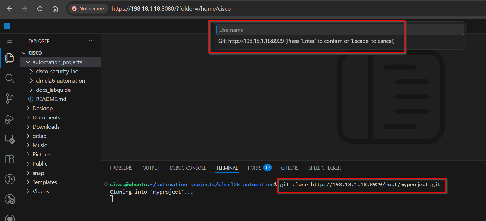

# dCloud Automation — Lab Guide (docs)

Attendee-facing training lab guide for the two automation projects, published to
GitHub Pages: **<https://ranilf2005.github.io/dcloud_automation/>**

- **Lab 1 — NetDevOps CI/CD** (`clmel26_automation/`)
- **Lab 2 — Cisco Security IaC** (`cisco_security_iac/`)

## How it works

The site is **multi-page**. Each page is one Markdown file in [`content/`](content/) —
edit the Markdown, push, and GitHub Actions rebuilds and republishes the page
automatically (no need to touch any HTML).

| Path | Purpose |
|------|---------|
| [`content/index.md`](content/index.md) | **Home** — overview, lab access, code-server IDE, nav cards |
| [`content/lab1-netdevops.md`](content/lab1-netdevops.md) | **Lab 1** — NetDevOps CI/CD (concepts) |
| [`content/lab1-hands-on.md`](content/lab1-hands-on.md) | **Lab 1** — illustrated step-by-step walkthrough |
| [`content/lab2-security-iac.md`](content/lab2-security-iac.md) | **Lab 2** — Cisco Security IaC (FMC/FTD) |
| [`content/appendix.md`](content/appendix.md) | **Appendix** — credentials, cheat-sheet, troubleshooting |
| [`images/`](images/) | **All screenshots / pictures** live here (see below) |
| `build_html.py` | Renders every `content/*.md` into a self-contained `<slug>.html` |
| `tools/paste_image.py` | Clipboard → save into `images/` → insert the Markdown link |
| `*.html` | Generated pages (built by the workflow / `build_html.py`) |
| `../.github/workflows/pages.yml` | Runs the build and deploys to GitHub Pages on push |

## Edit a page

1. Open the matching file in [`content/`](content/) and edit the Markdown.
2. Commit and push to `main`.
3. The **Deploy Lab Guide to GitHub Pages** workflow runs `build_html.py` and
   republishes — the live page updates in a minute or two.

## Images & screenshots

**All pictures live in [`images/`](images/).** Save any new screenshot there and
reference it from Markdown as `images/<file>` — for example:

```markdown

*Figure 12 — an optional italic caption under the image.*
```

> **Why `images/<file>` and not `../images/<file>`?** You author pages in
> `content/`, but the builder renders each page to `docs_labguide/<slug>.html`
> (one level up), right next to the `images/` folder. So image links are written
> **relative to the built page** (`images/...`), not to the Markdown file.

### Paste from the clipboard (no manual paths)

Instead of typing paths, copy an image (a screenshot, or an image file in the
file manager) and run the helper — it saves the image into `images/` with an
auto-numbered name and inserts the correct `` link for you:

```bash
# one-time install
pip install -r tools/requirements.txt

# copy a screenshot to the clipboard, then:
python tools/paste_image.py --page lab1-hands-on --caption "CML dashboard"
```

- `--page <slug>` picks the target page (default: the most recently edited
  `content/*.md`). Use `--file <path>` to point at a specific file.
- The image is saved as `images/<page>-NN.png` (auto-incrementing).
- The link is inserted just before a `<!-- paste-image -->` marker if the page
  has one, otherwise appended at the end. Move it where you want it.
- `--no-insert` just saves the file and prints the snippet.

## Front-matter

Each `content/*.md` starts with a small block that controls its title, sidebar
label, sort order, and home-page card:

```yaml
---
title: Lab 1 — NetDevOps CI/CD   # <title> + card heading
nav: Lab 1 · NetDevOps           # short label in the sidebar / cards
order: 2                         # sort order across the site
eyebrow: Lab 1                   # small kicker above the card title
description: one-line summary     # <meta> + card body text
---
```

The home page (order 1) contains a `<!-- CARDS -->` marker that is replaced with
navigation cards for every other page. **Add a new page** by dropping another
`content/<name>.md` with front-matter — it appears in the sidebar and cards
automatically.

## Preview / rebuild locally

```bash
python3 build_html.py     # writes index.html + one .html per content/*.md
```

Open any generated `.html` in a browser. Each page embeds its Markdown inline and
renders it with marked + Mermaid + highlight.js (via CDN), so it works opened
directly (`file://`) or served statically.
