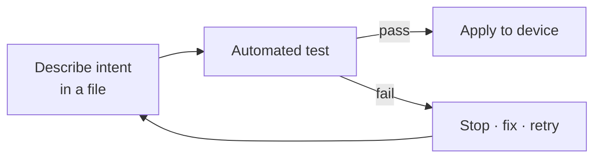
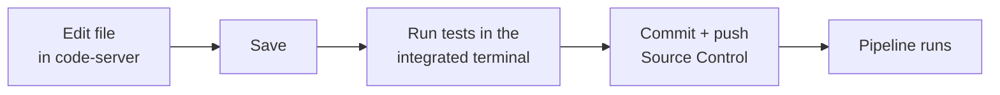

# dCloud Automation — Training Lab Guide

> **Audience:** Network & security engineers attending the automation labs.
> **What you'll learn:** How to build, test, and deploy network **and** firewall
> configuration *as code*, with automated guardrails so a change only reaches a
> device when every test passes.
>
> This guide covers **two labs**:
>
> | # | Lab | Tech | Folder |
> |---|-----|------|--------|
> | 1 | **NetDevOps CI/CD** — routers as code | pyATS · Ansible · GitLab CI/CD | `clmel26_automation/` |
> | 2 | **Cisco Security IaC** — FMC/FTD firewall as code | Terraform · REST API · Ansible | `cisco_security_iac/` |

<!-- CARDS -->

---

## Before you begin

**Prerequisites**

- Basic familiarity with the CLI, Git, and Cisco IOS / firewall concepts.
- No prior Terraform/Ansible/pyATS experience required — every command is given.

**Golden rule of this training:** *infrastructure as code*. You never log in to a
device and type commands by hand (except for the one deliberate troubleshooting
step in Lab 1). Instead you **describe intent in a file**, a pipeline **tests** it,
and only a passing test is **applied** to the device.

---

## Lab environment & access

Everything runs on a workstation you can reach in the browser — no local install.

| Service | URL / address | Credentials |
|---------|---------------|-------------|
| **code-server** (browser VS Code) | `https://198.18.1.18:8080` | password `C1sco12345` |
| **GitLab** (CI/CD + Pages) | `http://198.18.1.18:8929` | `root` / `C1sco12345` |
| Devbox (lab automation host) | `198.18.1.4` | `cisco` / `C1sco12345` |
| Cisco CML (virtual topology) | `https://198.18.1.2` | `admin` / `C1sco12345` |

> **Tip:** Open **code-server** first. It opens straight into `/home/cisco/` with a
> dark theme and all language extensions (Python, Ansible, Terraform, YAML, XML,
> Jinja, JSON, HTML …) pre-installed. Both lab folders live under
> `~/automation_projects/`.

Open a terminal in code-server (**Terminal ▸ New Terminal**) for every command below.

---

## The codebase server IDE (code-server)

**code-server is your IDE for this entire training** — a full **Visual Studio Code
running in your browser**. All editing, terminals, Git, and test runs for **both
labs** happen here; there is nothing to install on your laptop.

| Property | Value |
|----------|-------|
| URL | **https://198.18.1.18:8080** (self-signed TLS — accept the warning once) |
| Password | `C1sco12345` |
| Version | code-server 4.129.0 (VS Code 1.129) |
| Opens in | `/home/cisco/` with a dark theme |
| Projects | `~/automation_projects/clmel26_automation/` and `~/automation_projects/cisco_security_iac/` |

**Pre-installed language support:** Python (Ruff, Black, Flake8, Mypy, debugpy),
Ansible, Terraform / HCL, YAML, XML, JSON, Jinja2, HTML/CSS, Docker, GitLab
Workflow, Markdown, and shell — so every file in these labs is highlighted, linted,
and auto-completed out of the box.

### Sign in and get oriented

1. Open **https://198.18.1.18:8080** in your browser. It uses a **self-signed
   certificate**, so accept the browser warning once (**Advanced ▸ Proceed to
   198.18.1.18**). HTTPS is what makes **copy/paste and the clipboard** work in the
   IDE. Then enter the password `C1sco12345`.
2. The **Explorer** on the left opens on `/home/cisco/`. Hidden dot-files are
   hidden, so you only see your working folders — expand **`automation_projects/`**
   to find the two labs.
3. Open the integrated terminal with **Terminal ▸ New Terminal** (or press
   `` Ctrl+` ``). **Every command in this guide is run in this terminal.**

### Make every change here (the "as code" loop)

1. **Edit** an intent file — for example
   `clmel26_automation/ansible/vars/vlans.yml` or a file under
   `cisco_security_iac/` — and save with `Ctrl+S`.
2. **Test / validate** from the integrated terminal (pyATS, `ansible-playbook`,
   `terraform validate`, `pytest`, …).
3. **Commit and push** using the built-in **Source Control** panel or `git` in the
   terminal. In Lab 1 the push triggers the GitLab pipeline automatically.

> Throughout this guide, whenever you read *"open a terminal"* or *"edit the
> file"*, do it **in code-server**.

