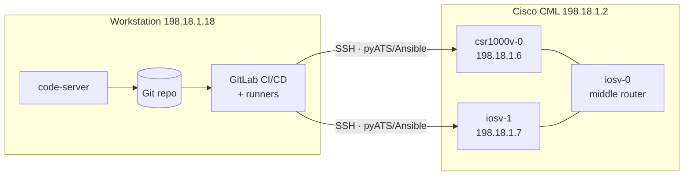
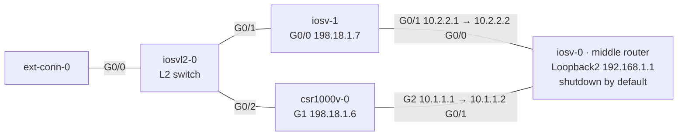
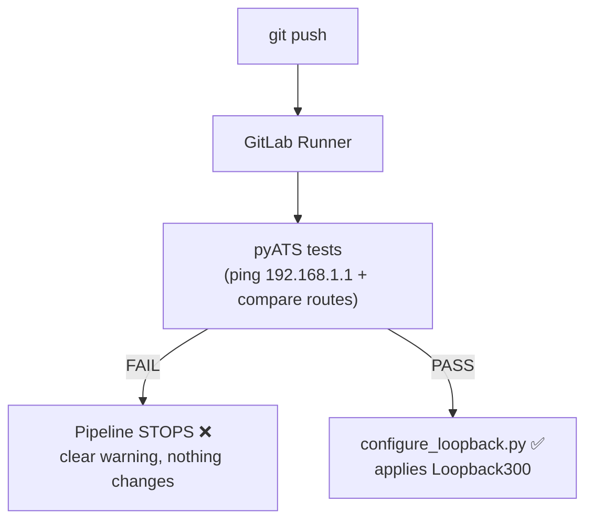

# Lab 1 — NetDevOps CI/CD

> **Tech:** pyATS · Ansible · GitLab CI/CD — folder `clmel26_automation/`.
> New here? Start on the [Home](index.html) page for lab access and the code-server IDE.
>
> 👉 **Ready to do the lab?** This page explains *how the pipeline works*. For the
> fully illustrated, click-by-click instructions, go to the
> **[Lab 1 — Hands-on Walkthrough](lab1-hands-on.html)**.

## 1.1 Goals & concepts

You will run a GitLab pipeline that validates a change against **virtual routers**
in Cisco CML and only configures them when the tests pass.

- **Case A — all tests pass** → pipeline **SUCCESS**, `Loopback300` is configured.
- **Case B — any test fails** → pipeline **FAILED**, nothing is configured.

This is the **guardrail** pattern: tests are a gate in front of production.

Two devices are managed:

| Device | OS | Mgmt IP |
|--------|----|---------|
| `csr1000v-0` | IOS-XE | `198.18.1.6` |
| `iosv-1` | IOS | `198.18.1.7` |

## 1.2 Topology



**Physical CML topology.** The two *managed* routers — `iosv-1` (`198.18.1.7`) and
`csr1000v-0` (`198.18.1.6`) — reach a shared target through the middle router
`iosv-0`. That target, **`Loopback2 = 192.168.1.1` on `iosv-0`, is `shutdown` by
default** — which is the fault you repair in the troubleshooting exercise (§1.7).



## 1.3 How the pipeline works



The pipeline is defined in `.gitlab-ci.yml` with three stages: **validate → network_check → deploy**.

## 1.4 Repository tour — every file explained

```
clmel26_automation/
├── .gitlab-ci.yml            # the pipeline: validate → network_check → deploy
├── requirements.txt          # pyATS[full], genie, PyYAML
├── testbed/testbed.yaml      # device inventory for pyATS (IPs, creds, SSH options)
├── jobs/
│   ├── smoke_job.py          # pyATS job entry point
│   ├── configure_loopback.py # applies Loopback300 when tests pass
│   ├── ping_and_loopback.py  # ping gate → creates Loopback3 (duplicate-checked)
│   └── tests/test_ping_routes.py  # ping + static-route test cases
├── configs/
│   ├── loopbacks.yaml        # declarative Loopback300 (2.2.2.2)
│   └── loopback3.yaml        # declarative Loopback3 + ping target
└── ansible/                  # Ansible VLAN task (GitHub Actions guardrail)
    ├── inventory/hosts.yml   # test + prod device groups
    ├── group_vars/all.yml    # connection credentials
    ├── vars/vlans.yml        # VLAN intent — attendees edit this
    └── playbooks/
        ├── validate_vlans.yml    # schema asserts (no device touched)
        └── configure_vlans.yml   # applies VLANs to routers
```

**Key files in detail**

- **`testbed/testbed.yaml`** — the pyATS "testbed": each device's OS, mgmt IP, and
  credentials (`admin` / `C1sco12345`). It also sets legacy SSH options
  (`diffie-hellman-group14-sha1`, `ssh-rsa`) required to reach the virtual IOS images.
- **`jobs/tests/test_ping_routes.py`** — two test cases:
  - `PingGateway` — every router must ping `192.168.1.1` at **100%**.
  - `StaticRoutesEqual` — both routers must have the **same** static routes.
- **`jobs/ping_and_loopback.py`** — the pipeline's `network_check`: pings the target;
  **only if all pass** does it create `Loopback3`, skipping any duplicate.
- **`configs/loopback3.yaml`** — declares `ping_target: 192.168.1.1` and the
  `Loopback3` addresses (`3.3.3.1` on the IOS-XE, `3.3.3.2` on the IOS device).
- **`ansible/vars/vlans.yml`** — the file attendees edit to add VLANs; the
  `validate_vlans.yml` playbook asserts each VLAN id/name/interface *before* any
  device is touched.

## 1.5 Step-by-step setup

> The devbox (`198.18.1.4`) already has this installed. To set it up on a fresh host:

```bash
cd ~/automation_projects/clmel26_automation

# 1) Python virtual environment + dependencies
python3 -m venv .venv
source .venv/bin/activate
pip install -r requirements.txt          # pyATS, Genie, PyYAML

# 2) Ansible collections (for the VLAN task)
cd ansible
ansible-galaxy collection install -r requirements.yml   # cisco.ios, ansible.netcommon
cd ..
```

## 1.6 Test scenarios — what & why

| # | Test | What it checks | Why it matters |
|---|------|----------------|----------------|
| 1 | **pyATS ping** | Every router can reach `192.168.1.1` | Proves data-plane reachability before making changes |
| 2 | **pyATS routes** | Both routers share identical static routes | Catches config drift between devices |
| 3 | **Ansible VLAN validate** | VLAN id 1–4094, valid name, valid interface | Blocks bad intent *before* it reaches a device |
| 4 | **Loopback duplicate-check** | `Loopback3` / IP not already present | Makes the change **idempotent** — safe to re-run |

**Run the offline Ansible validation (no device needed):**

```bash
cd ~/automation_projects/clmel26_automation/ansible
source ../.venv/bin/activate
ansible-playbook playbooks/validate_vlans.yml     # asserts every VLAN in vars/vlans.yml
yamllint .
ansible-lint playbooks/
```

**Run the pyATS tests against the routers (from the devbox `198.18.1.4`):**

```bash
pyats run job jobs/smoke_job.py --testbed-file testbed/testbed.yaml
```

## 1.7 The troubleshooting exercise

This lab ships **intentionally broken** so you can practise reading a pipeline
failure. The **`Loopback2`** interface that owns `192.168.1.1` (on the middle
router `iosv-0`) is deliberately **`shutdown`**.

**Expected first run — Case B (failure):**

```
PIPELINE FAILED  -  ping pre-check did not pass
One or more routers cannot reach 192.168.1.1, so Loopback3 was
NOT created on ANY device. Fix reachability and re-run the pipeline.
  - csr1000v-0 could NOT reach 192.168.1.1 - success rate 0% (need >= 80%)
  - iosv-1 could NOT reach 192.168.1.1 - success rate 0% (need >= 80%)
```

**Your task (the *only* manual CLI step in this lab):**

1. Read the pipeline log and identify the failing test (the ping to `192.168.1.1`).
2. Open the `iosv-0` console in CML and bring the interface up:
   ```
   configure terminal
    interface Loopback2
     no shutdown
    end
   write memory
   ```
3. Re-run the pipeline. It now reaches **Case A** — tests pass and `Loopback300` /
   `Loopback3` are configured.

> **Why:** attendees learn that the pipeline *protects* the network — the failure is
> informative, and the fix is obvious from the message.

## 1.8 Verification checklist

- [ ] `validate_vlans.yml` prints **"All VLAN/interface checks passed"**.
- [ ] First pipeline run **fails** at the ping stage (Case B) with the message above.
- [ ] After `no shutdown`, the pipeline **passes** (Case A).
- [ ] On each router, `show ip interface brief` lists `Loopback300` (and `Loopback3`).
