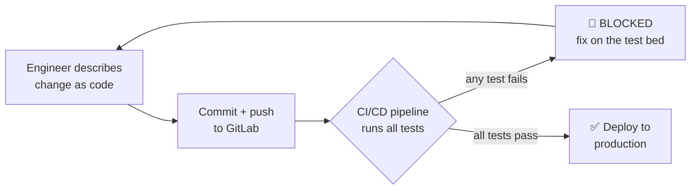
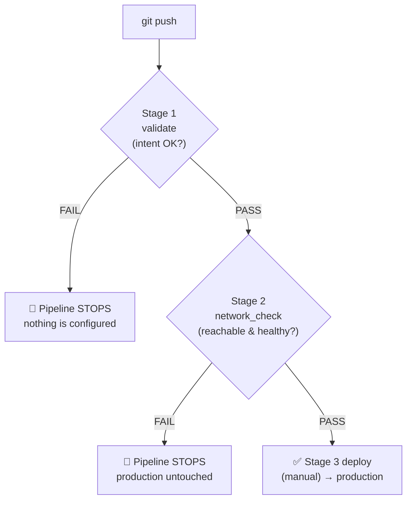
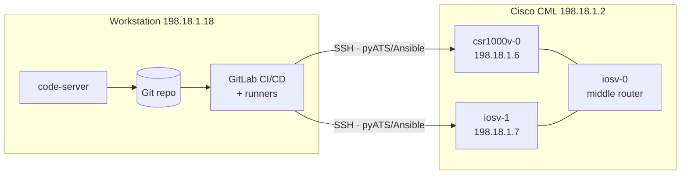
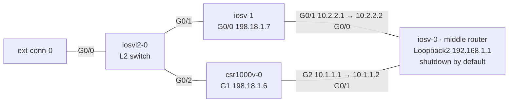
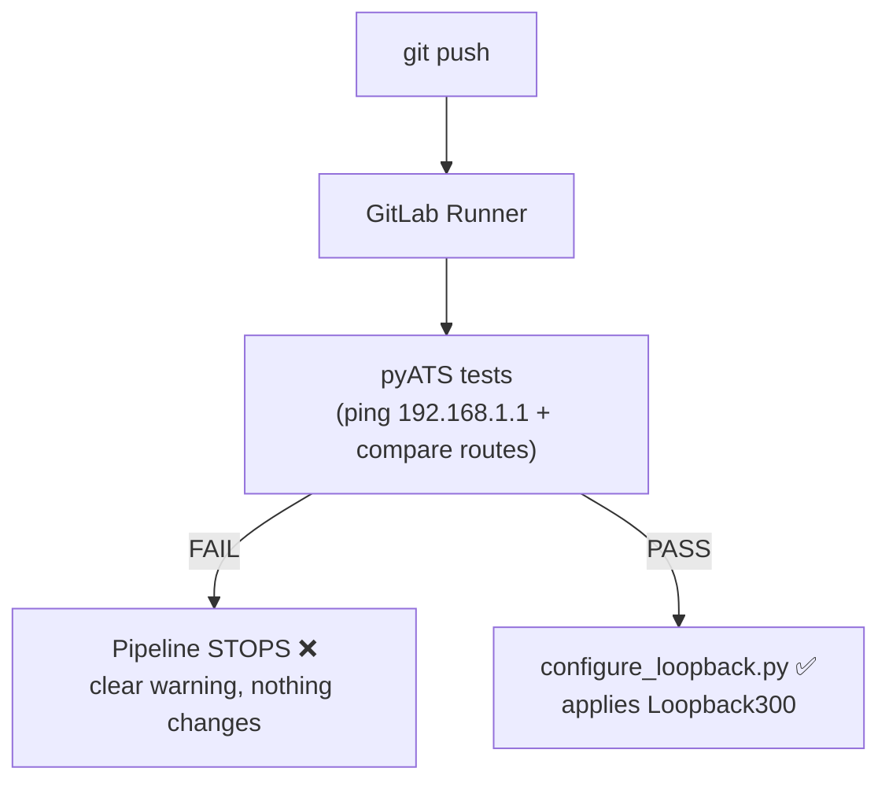

# Lab 1 — NetDevOps CI/CD

> **Tech:** pyATS · Ansible · GitLab CI/CD — folder `clmel26_automation/`.
> New here? Start on the [Home](index.html) page for lab access and the code-server IDE.
>
> 👉 **Ready to do the lab?** This page explains *how the pipeline works*. For the
> fully illustrated, click-by-click instructions, go to the
> **[Lab 1 — Hands-on Walkthrough](lab1-hands-on.html)**.

## What this lab is about (the big picture)

In this lab you use a **GitLab CI/CD pipeline as a test & change-management
framework** for network configuration. The idea is simple but powerful:

> **Every change is described as code, automatically tested, and only allowed to
> reach production once every test passes.**

**What are we actually testing?** Before any router is changed, the pipeline checks
that the change is *correct* and *safe*:

- ✅ **Intent is valid** — the requested config (e.g. VLAN IDs, names, interfaces)
  follows the rules *before* it is ever sent to a device.
- ✅ **The network is reachable & healthy** — the target devices respond and the
  routing state is what we expect.
- ✅ **The change is idempotent** — running it twice does no harm (no duplicates).
- ✅ **Only then deploy** — configuration is applied to production devices *only*
  after all of the above pass.

**Why this matters — no more manual mistakes.** In a traditional workflow an engineer
logs into a device and types commands by hand — one typo can take down a site.
With this framework:

- 🚫 Engineers **do not** make changes directly on production devices.
- 🧪 Every change is first proven on a **test bed** (here, virtual routers in Cisco CML).
- 🚦 The pipeline is a **gate**: a change that fails *any* test is **blocked** and
  **never reaches production**.
- 👀 Every change is a Git commit — **reviewable, versioned, and auditable**.



## The framework — how the pipeline gates a change

The pipeline (defined in `.gitlab-ci.yml`) runs in **ordered stages**. A later stage
only runs if the earlier one **passed** — so a broken change stops at the first gate
and everything after it is skipped.

| Stage | Name | What it does | If it fails |
|-------|------|--------------|-------------|
| 1 | **validate** | Checks the *intent* offline (VLAN IDs/names/interfaces) — no device is touched | Pipeline **stops**; nothing else runs |
| 2 | **network_check** | Talks to the routers: ping the target, verify routing, create Loopback3 | Pipeline **stops**; production is **not** touched |
| 3 | **deploy** | Applies the change to production routers — **manual** button | Only reachable when 1 & 2 pass |

> **Key rule:** stages are **sequential gates**. `Stage 2` must *wait for* `Stage 1`.
> If they run independently, a broken change could slip past Stage 1 — which is
> exactly the first bug you fix in this lab.

## What you'll do — high-level tasks

Here is the whole lab at a glance. Each task is explained in detail further down and
shown click-by-click in the **[Hands-on Walkthrough](lab1-hands-on.html)**.

1. **Create a GitLab project** — the home for your network-as-code repository.
2. **Clone the repo to the local server** (code-server) — your working copy.
3. **Add the project files** — create them, or copy them from the solution folder.
4. **Commit & push to GitLab** — the push automatically **triggers the pipeline**.
5. **First run → pipeline FAILS.** Stage 1 (validate) fails, **but** Stage 2 still
   ran and passed — because the stages were **not gated** correctly.
6. **Fix the gating** — make Stage 2 *depend on* Stage 1, so that **if Stage 1
   fails, the whole pipeline stops** and nothing proceeds. (Re-run to confirm.)
7. **Fix the Stage 1 issue** (an invalid VLAN) and commit again → now **Stage 1
   passes, Stage 2 fails** — the pipeline has caught a *real* network fault.
8. **Troubleshoot & fix the Stage 2 issue** (a network problem on a device), then
   commit and re-run.
9. **All stages pass** ✅ — the change is proven safe and is ready to deploy to
   production.

**The point of the two deliberate failures:** you learn to *read a pipeline failure*,
understand *why the gate stopped the change*, and fix it — the exact skill you need
to run this safely at work.

## Pass / fail — what happens on each run

As you work through the lab, the same push produces different results. This is the
framework doing its job — **catching problems on the test bed, never in production.**



| Run | Stage 1 · validate | Stage 2 · network_check | Pipeline result | What it teaches |
|-----|--------------------|-------------------------|-----------------|-----------------|
| **1 — first push** | ❌ FAIL (bad VLAN) | ⚠️ PASS (ran independently) | ❌ **FAILED** | Stages weren't gated — a broken change slipped past Stage 1 |
| **2 — after gating fix** | ❌ FAIL (bad VLAN) | ⏭️ SKIPPED | ❌ **FAILED** | Now a Stage 1 failure **stops** the whole pipeline |
| **3 — after fixing the VLAN** | ✅ PASS | ❌ FAIL (can't reach target) | ❌ **FAILED** | Stage 2 catches a *real* network fault before production |
| **4 — after fixing the network** | ✅ PASS | ✅ PASS | ✅ **SUCCESS** | Change is proven safe → ready to deploy |

## What you'll learn (and take back to your company)

By the end you'll be able to run **infrastructure as code** with automated
guardrails — and apply the same pattern to your own company's network:

- 🧩 **Describe network changes as code** (YAML/Ansible/pyATS) instead of typing on devices.
- 🧪 **Test every change automatically** on a test bed before it touches production.
- 🚦 **Gate production behind passing tests** using ordered CI/CD stages.
- 🔎 **Read and troubleshoot a pipeline failure** and fix it fast.
- ♻️ **Make changes idempotent and repeatable** across many devices.

**Business benefits of this approach:**

- ✅ **Fewer outages** — mistakes are caught in minutes on the test bed, not in a production incident.
- ✅ **No risky manual CLI** — engineers can't accidentally break production; the gate protects it.
- ✅ **Full audit trail** — every change is a reviewable, versioned Git commit (who changed what, when, and why).
- ✅ **Fast, safe rollback** — revert a commit to undo a change.
- ✅ **Consistency at scale** — the same tested config is applied everywhere; no config drift.
- ✅ **Repeatable & scalable** — the same pattern works for 2 devices or 2,000.

---

## 1.1 Goals & concepts

You will run a GitLab pipeline that validates a change against **virtual routers**
in Cisco CML and only configures them when the tests pass.

- **Case A — all tests pass** → pipeline **SUCCESS**, `Loopback300` is configured.
- **Case B — any test fails** → pipeline **FAILED**, nothing is configured.

This is the **guardrail** pattern: tests are a gate in front of production.

Two devices are managed:

| Device | OS | Mgmt IP |
|--------|----|---------|
| `csr1000v-0` | IOS-XE | `198.18.1.6` |
| `iosv-1` | IOS | `198.18.1.7` |

## 1.2 Topology



**Physical CML topology.** The two *managed* routers — `iosv-1` (`198.18.1.7`) and
`csr1000v-0` (`198.18.1.6`) — reach a shared target through the middle router
`iosv-0`. That target, **`Loopback2 = 192.168.1.1` on `iosv-0`, is `shutdown` by
default** — which is the fault you repair in the troubleshooting exercise (§1.7).



## 1.3 How the pipeline works



The pipeline is defined in `.gitlab-ci.yml` with three stages: **validate → network_check → deploy**.

## 1.4 Repository tour — every file explained

```
clmel26_automation/
├── .gitlab-ci.yml            # the pipeline: validate → network_check → deploy
├── requirements.txt          # pyATS[full], genie, PyYAML
├── testbed/testbed.yaml      # device inventory for pyATS (IPs, creds, SSH options)
├── jobs/
│   ├── smoke_job.py          # pyATS job entry point
│   ├── configure_loopback.py # applies Loopback300 when tests pass
│   ├── ping_and_loopback.py  # ping gate → creates Loopback3 (duplicate-checked)
│   └── tests/test_ping_routes.py  # ping + static-route test cases
├── configs/
│   ├── loopbacks.yaml        # declarative Loopback300 (2.2.2.2)
│   └── loopback3.yaml        # declarative Loopback3 + ping target
└── ansible/                  # Ansible VLAN task (GitHub Actions guardrail)
    ├── inventory/hosts.yml   # test + prod device groups
    ├── group_vars/all.yml    # connection credentials
    ├── vars/vlans.yml        # VLAN intent — attendees edit this
    └── playbooks/
        ├── validate_vlans.yml    # schema asserts (no device touched)
        └── configure_vlans.yml   # applies VLANs to routers
```

**Key files in detail**

- **`testbed/testbed.yaml`** — the pyATS "testbed": each device's OS, mgmt IP, and
  credentials (`admin` / `C1sco12345`). It also sets legacy SSH options
  (`diffie-hellman-group14-sha1`, `ssh-rsa`) required to reach the virtual IOS images.
- **`jobs/tests/test_ping_routes.py`** — two test cases:
  - `PingGateway` — every router must ping `192.168.1.1` at **100%**.
  - `StaticRoutesEqual` — both routers must have the **same** static routes.
- **`jobs/ping_and_loopback.py`** — the pipeline's `network_check`: pings the target;
  **only if all pass** does it create `Loopback3`, skipping any duplicate.
- **`configs/loopback3.yaml`** — declares `ping_target: 192.168.1.1` and the
  `Loopback3` addresses (`3.3.3.1` on the IOS-XE, `3.3.3.2` on the IOS device).
- **`ansible/vars/vlans.yml`** — the file attendees edit to add VLANs; the
  `validate_vlans.yml` playbook asserts each VLAN id/name/interface *before* any
  device is touched.

## 1.5 Step-by-step setup

> The devbox (`198.18.1.4`) already has this installed. To set it up on a fresh host:

```bash
cd ~/automation_projects/clmel26_automation

# 1) Python virtual environment + dependencies
python3 -m venv .venv
source .venv/bin/activate
pip install -r requirements.txt          # pyATS, Genie, PyYAML

# 2) Ansible collections (for the VLAN task)
cd ansible
ansible-galaxy collection install -r requirements.yml   # cisco.ios, ansible.netcommon
cd ..
```

## 1.6 Test scenarios — what & why

| # | Test | What it checks | Why it matters |
|---|------|----------------|----------------|
| 1 | **pyATS ping** | Every router can reach `192.168.1.1` | Proves data-plane reachability before making changes |
| 2 | **pyATS routes** | Both routers share identical static routes | Catches config drift between devices |
| 3 | **Ansible VLAN validate** | VLAN id 1–4094, valid name, valid interface | Blocks bad intent *before* it reaches a device |
| 4 | **Loopback duplicate-check** | `Loopback3` / IP not already present | Makes the change **idempotent** — safe to re-run |

**Run the offline Ansible validation (no device needed):**

```bash
cd ~/automation_projects/clmel26_automation/ansible
source ../.venv/bin/activate
ansible-playbook playbooks/validate_vlans.yml     # asserts every VLAN in vars/vlans.yml
yamllint .
ansible-lint playbooks/
```

**Run the pyATS tests against the routers (from the devbox `198.18.1.4`):**

```bash
pyats run job jobs/smoke_job.py --testbed-file testbed/testbed.yaml
```

## 1.7 The troubleshooting exercise

This lab ships **intentionally broken** so you can practise reading a pipeline
failure. The **`Loopback2`** interface that owns `192.168.1.1` (on the middle
router `iosv-0`) is deliberately **`shutdown`**.

**Expected first run — Case B (failure):**

```
PIPELINE FAILED  -  ping pre-check did not pass
One or more routers cannot reach 192.168.1.1, so Loopback3 was
NOT created on ANY device. Fix reachability and re-run the pipeline.
  - csr1000v-0 could NOT reach 192.168.1.1 - success rate 0% (need >= 80%)
  - iosv-1 could NOT reach 192.168.1.1 - success rate 0% (need >= 80%)
```

**Your task (the *only* manual CLI step in this lab):**

1. Read the pipeline log and identify the failing test (the ping to `192.168.1.1`).
2. Open the `iosv-0` console in CML and bring the interface up:
   ```
   configure terminal
    interface Loopback2
     no shutdown
    end
   write memory
   ```
3. Re-run the pipeline. It now reaches **Case A** — tests pass and `Loopback300` /
   `Loopback3` are configured.

> **Why:** attendees learn that the pipeline *protects* the network — the failure is
> informative, and the fix is obvious from the message.

## 1.8 Verification checklist

- [ ] `validate_vlans.yml` prints **"All VLAN/interface checks passed"**.
- [ ] First pipeline run **fails** at the ping stage (Case B) with the message above.
- [ ] After `no shutdown`, the pipeline **passes** (Case A).
- [ ] On each router, `show ip interface brief` lists `Loopback300` (and `Loopback3`).
