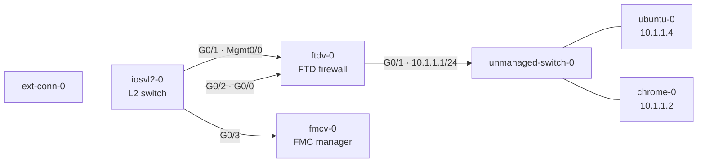
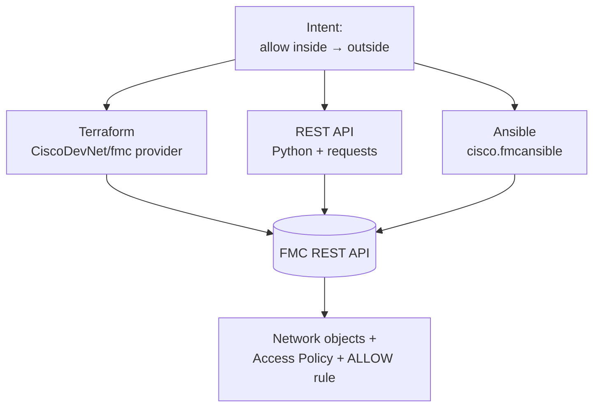
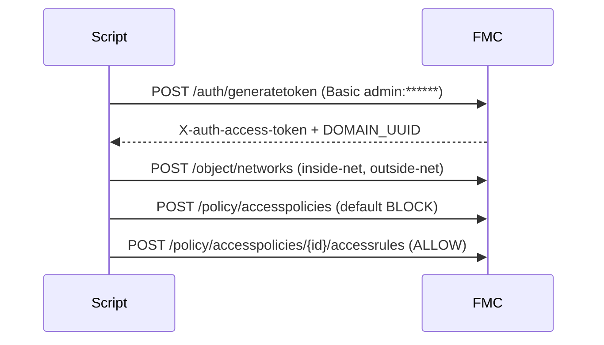

# Lab 2 — Cisco Security IaC (FMC/FTD)

> **Tech:** Terraform · REST API · Ansible — folder `cisco_security_iac/`.
> New here? Start on the [Home](index.html) page for lab access and the code-server IDE.

## 2.1 Goals & concepts

Create, **as code**, a firewall change on a Cisco Secure Firewall Management
Center (FMC): a **network object** and an **access control policy** that **allows
traffic from inside to outside**. You'll do the *same outcome* three ways —
**Terraform**, **REST API**, and **Ansible** — to compare the tools.

> **Safety:** In this training the code is **validated offline** and is **not** run
> against the live FMC by default. Each tool has a safe "dry-run"/validate path.

## 2.2 Topology & addressing



*In the CML virtual lab above, the FMC manages the FTD over the management network
(`198.18.1.x`). User traffic flows from the **inside** hosts (`10.1.1.0/24`) out
through the FTD to the **outside** (`198.18.1.0/24`).*

The security lab exists in two forms. In **both**, the **outside** network is
`198.18.1.0/24`; the **inside** network differs.

**CML virtual lab** — outside `198.18.1.0/24`, **inside `10.1.1.0/24`**:

| CML node | Address |
|----------|---------|
| CML network0 / network1 | `198.18.1.2` / `198.18.1.3` |
| fmcv (FMC) | `198.18.1.22` |
| ftdv (FTD management) | `198.18.1.23` |
| ftdv **outside** | `198.18.1.24` |
| ftdv **inside** | `10.1.1.1` |
| ubuntu-0 / chrome-0 (inside hosts) | `10.1.1.4` / `10.1.1.2` |

**dCloud FMC/FTD** — outside `198.18.1.0/24`, **inside `198.18.2.0/24`** (two pairs;
the IaC targets these):

| Role | Pair A (v7.6) | Pair B |
|------|---------------|--------|
| FMC management | `198.18.1.10` | `198.18.1.11` |
| FTD management | `198.18.1.20` | `198.18.1.21` |
| FTD interface1 (**outside**) | `198.18.1.12` | `198.18.1.15` |
| FTD interface4 (**inside**) | `198.18.2.12` | `198.18.2.13` |

**Other dCloud hosts:**

| Host | Address | Notes |
|------|---------|-------|
| Ubuntu 26.04 LAN | `198.18.2.10` | inside host — change its gateway to FTD764 or FTD100 |
| Ubuntu 26.04 (test) | `198.18.1.18` | workstation — code-server + lab GitLab |
| Ubuntu 25.04 (CWS) | `198.18.1.4` | devbox |
| Windows 11 | `198.18.1.8` | test client |

- **Credentials:** `admin` / `Cisco@123` (both FMC and FTD)

> The IaC creates its network objects using the **dCloud** networks: inside
> `198.18.2.0/24` → outside `198.18.1.0/24`. To run against **CML** instead, point
> the FMC URL at `198.18.1.22` and use inside `10.1.1.0/24`.

## 2.3 Three ways to do the same thing

Every scenario produces the **same** four objects on the FMC:

1. Network object `inside-net` = `198.18.2.0/24`
2. Network object `outside-net` = `198.18.1.0/24`
3. Access Control Policy `inside-to-outside-policy` (default action **BLOCK**)
4. Rule `allow-inside-to-outside` — action **ALLOW**, source `inside-net`, destination `outside-net`



## 2.4 Terraform scenario

Folder `cisco_security_iac/terraform/`. Uses the **`CiscoDevNet/fmc`** provider (v2.x, tested against FMC 7.6).

| File | What it declares |
|------|------------------|
| `versions.tf` | Terraform + provider version constraints |
| `providers.tf` | FMC connection (`url`, `username`, `password`, `insecure`) |
| `variables.tf` | Inputs (FMC URL, creds, inside/outside CIDRs, policy name) |
| `objects.tf` | Two `fmc_network` objects (inside/outside subnets) |
| `zones.tf` | Two `fmc_security_zone` objects (inside/outside) |
| `access_policy.tf` | `fmc_access_control_policy` + inline **ALLOW** rule |
| `outputs.tf` | Prints the created object / policy IDs |

**The core of `access_policy.tf`:**

```hcl
resource "fmc_access_control_policy" "inside_to_outside" {
  name           = var.acp_name
  default_action = "BLOCK"          # deny by default …
  manage_rules   = true
  rules = [{
    name    = "allow-inside-to-outside"
    action  = "ALLOW"              # … but allow inside → outside
    source_zones           = [{ id = fmc_security_zone.inside.id }]
    destination_zones      = [{ id = fmc_security_zone.outside.id }]
    source_network_objects = [{ id = fmc_network.inside_net.id, type = "Network" }]
    destination_network_objects = [{ id = fmc_network.outside_net.id, type = "Network" }]
  }]
}
```

**Run it (offline validation — no FMC contacted):**

```bash
cd ~/automation_projects/cisco_security_iac/terraform
terraform init         # downloads the FMC provider
terraform fmt -check
terraform validate     # checks the config against the real provider schema
```

**Apply it to a live FMC (only when you intend to change it):**

```bash
export TF_VAR_fmc_password='Cisco@123'   # keep the secret out of files
terraform plan                            # preview
terraform apply                           # create the objects + policy
```

## 2.5 REST API scenario

Folder `cisco_security_iac/rest_api/`. A Python client that speaks the raw FMC REST API.

| File | Purpose |
|------|---------|
| `fmc_access_policy.py` | token auth → objects → policy → rule |
| `tests/test_payloads.py` | offline unit tests for the JSON payloads |
| `requirements.txt` | `requests`, `PyYAML`, `pytest` |

**The REST flow:**



**Run it — the script defaults to a safe dry-run (no FMC contacted):**

```bash
cd ~/automation_projects/cisco_security_iac
source .venv/bin/activate
python rest_api/fmc_access_policy.py --dry-run   # prints the 4 REST calls + payloads
cd rest_api && pytest                             # 3 offline unit tests
```

**Apply it to a live FMC:**

```bash
export FMC_HOST=198.18.1.10 FMC_USERNAME=admin FMC_PASSWORD='Cisco@123'
python fmc_access_policy.py --apply
```

## 2.6 Ansible scenario

Folder `cisco_security_iac/ansible/`. Uses the **`cisco.fmcansible`** collection.

| File | Purpose |
|------|---------|
| `create_access_policy.yml` | playbook: objects → policy → rule |
| `inventory.yml` | FMC management hosts |
| `group_vars/fmc.yml` | httpapi connection settings |
| `requirements.yml` | `cisco.fmcansible` collection |

**Each task calls one FMC REST operation and stores the result for the next task:**

```yaml
- name: Create the inside network object
  cisco.fmcansible.fmc_configuration:
    operation: createNetworkObject
    data: { name: inside-net, value: "198.18.2.0/24", type: Network }
    register_as: inside_net
```

**Run it (offline syntax check — no FMC contacted):**

```bash
cd ~/automation_projects/cisco_security_iac/ansible
source ../.venv/bin/activate
ansible-galaxy collection install -r requirements.yml
ansible-playbook create_access_policy.yml --syntax-check
```

**Apply it to a live FMC:**

```bash
export FMC_PASSWORD='Cisco@123'
ansible-playbook create_access_policy.yml
```

## 2.7 Test cases — what & why

| # | Test case | What we test | Why we test it |
|---|-----------|--------------|----------------|
| 1 | `terraform validate` | HCL matches the provider's real schema | Catches typos/wrong attributes **before** touching the FMC |
| 2 | `pytest` (REST) | JSON payload builders produce correct FMC bodies | Unit-level confidence with **no** FMC required |
| 3 | REST `--dry-run` | The exact API calls & order | Review what *would* be sent — a safe preview |
| 4 | `ansible-playbook --syntax-check` | Playbook parses, module/args resolve | Fails fast on YAML/module errors offline |
| 5 | *(apply)* object/policy present on FMC | End-state on the device | Confirms the intent actually landed |

## 2.8 Verification checklist

**Offline (what this training runs):**

- [ ] `terraform validate` → **"Success! The configuration is valid."**
- [ ] `pytest` → **3 passed**.
- [ ] `python fmc_access_policy.py --dry-run` prints 4 REST calls.
- [ ] `ansible-playbook … --syntax-check` → no errors.

**On a live FMC (optional, after `apply`):**

- [ ] FMC ▸ **Objects ▸ Network** shows `inside-net` and `outside-net`.
- [ ] FMC ▸ **Policies ▸ Access Control** shows `inside-to-outside-policy`.
- [ ] The policy contains an enabled **ALLOW** rule inside → outside.
